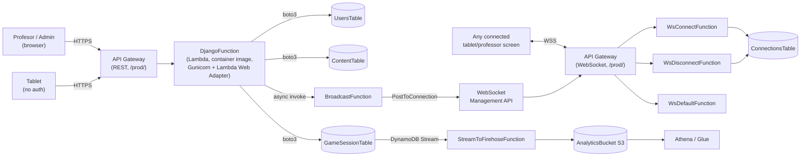

# Misión Emprende — Project Status & Architecture

Snapshot as of 2026-08-16. Covers: what changed recently, how the stack went
fully serverless, how authentication works today, and the current
architecture end to end.

---

## 1. Recent changes and new features

### 1.0 First CI run, frontend build fix, code-review pass (2026-08-16)

`main` was pushed to `origin/main` for the first time this session (see
former §1.7 below, now resolved) and GitHub Actions ran end to end for the
first time on this repo. That first run failed — not on anything
FIS/canary-related, but on a pre-existing frontend TypeScript build break
(`tsc`/`vite build`, ~410 errors across ~45 files) that had never been
caught locally since nothing had run `npm run build` in CI before. Fixed,
then CI secrets (`AWS_ACCESS_KEY_ID`/`AWS_SECRET_ACCESS_KEY`/
`AWS_SESSION_TOKEN`, and two that were missing entirely — `LAB_ROLE_ARN`/
`DJANGO_SECRET_KEY`) were set on the repo, and the pipeline went green
end to end including a real `sam deploy`.

A follow-up `/code-review high` pass over that build-fix diff surfaced 8
findings; 6 were fixed, 2 documented as deliberate non-fixes:

- **`template.yaml`**: `FisLambdaExtensionLayerArn` was an
  `AWS::SSM::Parameter::Value<String>` parameter, which CloudFormation
  resolves unconditionally on *every* deploy regardless of whether FIS is
  active — changed to a plain `String` param (default `''`), passed
  manually at FIS-activation time instead (`fis/README.md` updated with the
  `aws ssm get-parameter` lookup step). Also, the 5 Outputs that feed
  `fis/template.yaml`'s experiment targets pointed at `!GetAtt <Fn>.Arn`
  (bare `$LATEST`) instead of the `live` alias real traffic actually uses —
  changed all 5 to `!Ref <Fn>Aliaslive`.
- **Frontend**: a `Minijuego.tsx` branch cast `minigameData as WordSearchData`
  instead of narrowing on the discriminant like the sibling anagram branch
  already did — fixed to match. 4 `Dashboard.tsx` bar-chart `onClick`
  handlers read an `any`-typed id field with no guard — added null-guards.
  `main.tsx`'s toast cap (`<Toaster limit={3}>`) had been silently dropped
  during the build fix (`limit` isn't a real prop on the installed sonner
  version) — restored via the actual equivalent, `visibleToasts={3}`.
- **Services layer, systemic fix**: fixing `unwrapResults<any[]>` call sites
  properly (typing them against the real DRF serializer shapes instead of
  `any[]`) surfaced a much bigger pre-existing bug: ~20 frontend files still
  assumed `id: number` on session/team/activity-progress/etc. types, left
  over from before the DynamoDB migration (backend IDs are now DynamoDB
  UUIDs or stringified legacy integers — always strings). Fixed across all
  20 consuming page files plus the 9 service files that type them —
  page-local duplicate interfaces replaced with imports of the
  now-accurate, serializer-matched interfaces exported from each service
  file. One real bug caught along the way: `tablets/etapa1/Personalizacion.tsx`
  was constructing a `TeamPersonalization` object with a nonexistent `id`
  field.
- **Not fixed, documented only**: the FIS Lambda extension being always-on
  once `FisConfigBucketArn` is set (inherent to extension-based fault
  injection — the off-switch is redeploying with that param blank) and the
  `AutoPublishAlias`/FIS `Layers:`/`Environment:` block not being hoisted
  into `Globals: Function:` (would silently give `DjangoFunction` the FIS
  env var without its Lambda layer — SAM's Globals merge semantics differ
  between `Environment` (merges) and `Layers` (doesn't) — a real regression
  risk, not laziness).

Verified via a real `sam validate --lint`, `sam build && sam deploy` (no
FIS params — the routine path) and a second green GitHub Actions run after
push: outputs now resolve to `...:function:Name:live`, routine deploys
still succeed with the plain-String param, and `npm run build` is clean.

### 1.1 RDS MySQL → DynamoDB, full serverless cutover (committed `db2b51e9`)

The `academic`, `challenges`, and `admin_dashboard` Django apps were the last
pieces still backed by RDS MySQL (the `users` and `game_sessions` apps had
already been migrated to DynamoDB in earlier sessions). This change:

- Added a new shared `ContentTable` (DynamoDB, single-table design) for all
  three apps, with a repository layer (`academic/dynamodb/`,
  `challenges/dynamodb/`, `admin_dashboard/dynamodb/`) and a compatibility
  shim rewrite of `models.py` in each app — plain Python classes with
  `.objects`-style managers (`.get`/`.filter`/`.create`/`.get_or_create`)
  standing in for Django's ORM, so most call sites kept working unmodified.
- Added `challenges/management/commands/backfill_content_to_dynamodb.py` to
  migrate existing MySQL rows into `ContentTable`, preserving original
  integer IDs (stringified) so `game_sessions` items referencing them by ID
  don't break.
- Removed `RDSInstance`, `DBSecurityGroup`, `DBSubnetGroup`, both VPC
  endpoints, and `DjangoFunction`'s `VpcConfig` from `template.yaml` — the
  whole stack is now VPC-free.
- Removed Django's `/admin/` site (`django.contrib.admin`, `academic/admin.py`,
  `challenges/admin.py`, `admin_dashboard/admin.py`) and the dead
  `django_redis`/`CACHES` config (no Redis has existed in the deployed stack
  for a while; this just removed the leftover settings).
- Rewrote `academic/serializers.py`/`challenges/serializers.py` from
  `ModelSerializer` to plain `Serializer` (the shim classes have no
  `Meta.model._meta` for `ModelSerializer` to introspect).

### 1.2 `game_sessions` shim-compatibility bug fixes (147 → 0 test failures)

The DynamoDB migration's design decision to keep pre-existing content IDs as
integer-strings but mint fresh UUID4s for anything created afterward broke a
class of assumptions in `game_sessions/views.py`/`serializers.py` that
predated the migration. Root-caused and fixed:

- 24 sites doing `int(activity_id)`/`int(stage_id)`/etc. on now-string IDs.
- ~11 DRF `IntegerField()` serializer fields that needed to be `CharField()`.
- `Q()` objects and `__`-lookup ORM queries (`activity_type__name__icontains`,
  `stage__number=`) the plain-Python shim doesn't implement — rewritten as
  plain Python filtering over `.filter()`/`.get()` results.
- Missing shim features surfaced by the above: `Stage`/`ActivityType`
  `.filter(number=...)`/`.filter(code=...)`, `Activity.get()` accepting
  `stage=`/`activity_type=` kwargs (not just `id`), `Challenge.refresh_from_db()`.
- `select_challenge`'s persona-image upload used Django `ImageField`-style
  `.path`/`.save()` calls on what's now a plain string field — rewritten to
  use `django.core.files.storage.default_storage` directly.

Full suite: **680 passed, 0 failed** (was 147 failed before this pass).

### 1.3 CI/CD — GitHub Actions (`.github/workflows/deploy.yml`)

Push to `main` (or manual `workflow_dispatch`) runs the full test suite,
then — if it passes — builds the frontend, configures AWS credentials from
repo secrets, and runs `sam build && sam deploy`. AWS Academy Learner Lab
credentials are session-based and expire in hours; the workflow can't
refresh them itself, so deploys only succeed within a live lab session
until the `AWS_ACCESS_KEY_ID`/`AWS_SECRET_ACCESS_KEY`/`AWS_SESSION_TOKEN`
secrets are refreshed by hand.

### 1.4 Dead code cleanup

Removed: `mision_emprende_backend/docker-entrypoint.sh` (duplicate), the
`sessions/` Django app (empty skeleton), a foreign `misionEmprendeJose`
`package.json`/`node_modules` accidentally committed at repo root, 5 unused
frontend components, 1 superseded page, and 10 confirmed-dead frontend
service functions.

### 1.5 AWS FIS chaos testing (`fis/template.yaml`, new, **confirmed not deployable on this account**)

A separate CloudFormation stack (deliberately isolated from the main one —
see below) adding AWS Fault Injection Service experiment templates for the
event-driven Lambdas:

| Experiment | Target | What it tests |
|---|---|---|
| `WsConnectInvocationErrorExperiment` | `WsConnectFunction` | Frontend WS reconnect/backoff on a flaky `$connect` |
| `WsDisconnectInvocationErrorExperiment` | `WsDisconnectFunction` | Orphaned `ConnectionsTable` rows on failed cleanup |
| `WsDefaultInvocationErrorExperiment` | `WsDefaultFunction` | An unhandled-route failure doesn't kill the WS connection |
| `BroadcastInvocationErrorExperiment` | `BroadcastFunction` | **Highest priority** — no DLQ configured on this async-invoked function; does a dropped broadcast recover? |
| `StreamToFirehoseInvocationErrorExperiment` | `StreamToFirehoseFunction` | Confirms analytics failures never touch gameplay |

`DjangoFunction` is intentionally excluded — it's a container-image Lambda,
and the AWS FIS Lambda extension can't attach as a plain Layer to those
(would need manual Docker-image surgery, deferred as its own change).

**Confirmed blocked, two ways, both tested live (2026-08-16):** the original
version created a new IAM role trusted by `fis.amazonaws.com` — failed with
`iam:CreateRole` `AccessDenied`. A follow-up removed that role entirely and
pointed every experiment template's `RoleArn` straight at the account's
existing `LabRoleArn` instead (the same pattern already proven to work for
CodeDeploy, §1.6) — that got past the role-creation block, but hit a
different wall: CloudFormation deploys as the Learner Lab user's own session,
not `LabRole`, and that session has no policy allowing
`fis:CreateExperimentTemplate` at all. So this isn't an IAM-role-trust
problem and no `RoleArn` swap can fix it — FIS is denied to this account's
deploying identity outright. `fis/template.yaml` keeps the leaner
(`LabRoleArn`-as-`RoleArn`) version since re-adding the role wouldn't help.
Stack rolled back and was deleted cleanly both times, nothing left dangling.
See `fis/README.md` for the full error output and per-experiment rationale.

**Corroborated by a course-provided example** (`chaos-wallet-fis`, a separate
sample project, not part of this repo): it builds the identical shape —
`FisExperimentRole` trusted by `fis.amazonaws.com`, the same
`s3:PutObject`/`lambda:GetFunction`/`tag:GetResources` policy — and its own
`README-FIS.md` states outright it's for AWS accounts that **do** allow
`iam:CreateRole`, explicitly **not** AWS Academy Learner Lab, and its deploy
command takes `--profile <tu-perfil-sin-restricciones>` ("your unrestricted
profile"). The course material already assumes FIS demos run outside the
Lab account — confirming this isn't a technique we missed, just one that
was never meant to run here.

### 1.6 Canary deployment (**fully implemented and confirmed live on all 6 Lambdas**, 2026-08-16)

`AutoPublishAlias`/`DeploymentPreference` (AWS SAM's built-in gradual Lambda
deployment, backed by CodeDeploy), `Canary10Percent5Minutes`, on every
Lambda: `DjangoFunction`, `WsConnectFunction`, `WsDisconnectFunction`,
`WsDefaultFunction`, `BroadcastFunction`, `StreamToFirehoseFunction`. Real
traffic actually routes through the `live` alias on all 6, not just the
plumbing existing — the three WebSocket Lambdas' `ApiGatewayV2::Integration`
resources point at `${<Fn>Aliaslive}` (hand-wired, since SAM's `Events:`
sugar can't express raw WebSocket integrations), `BroadcastFunction` is
invoked with `Qualifier=live` (`DjangoFunction` passes
`BROADCAST_FUNCTION_QUALIFIER=live`, read in `game_sessions/broadcast.py`),
and `StreamToFirehoseFunction`/`DjangoFunction` use SAM's native `Events:`
sugar (`DynamoDB`/`Api`), which rewires to the alias automatically.

Rollout history:
- `WsDefaultFunction` shipped first, alone, with a bare `DeploymentPreference`
  (no alarms) as a low-risk probe: does this account's `LabRoleArn` even
  work as a CodeDeploy service role, since this account can't let SAM
  generate one? **Confirmed yes** — no `AccessDenied`, `CreateDeploymentGroup`
  succeeded (commit `c8b5259d`). Notably the *opposite* outcome from FIS's
  identical-shaped question (§1.5) about `fis.amazonaws.com` trust.
- `BroadcastFunction`'s runtime bumped `python3.11` → `python3.14` along the
  way (Lambda blocks *updates* to the deprecated runtime after 2026-08-31 —
  needed regardless of canary).
- With the trust relationship proven, `DeploymentPreference` +
  a CloudWatch `Errors`-metric alarm (`>=1` error/minute on the `live`
  alias, `TreatMissingData: notBreaching`) were added to the other 5
  functions, including `DjangoFunction` — a container-image
  (`PackageType: Image`) Lambda, the one untested combination (Lambda's
  alias/version traffic-shifting is documented as package-type agnostic,
  but this repo had never exercised it). **Deployed live and confirmed**:
  all 6 `AWS::CodeDeploy::DeploymentGroup` resources and all 6
  `AWS::CloudWatch::Alarm` resources created without error — unlike FIS,
  this account's restrictions didn't block CloudWatch alarm creation
  either. Post-deploy smoke check (`GET` on the live `DjangoApiUrl`) returned
  200, confirming alias-routed traffic still serves normally.

Nothing left open on canary — the routing-fix and role-trust questions this
section used to flag as unresolved are both settled.

### 1.7 Pushed to GitHub (resolved 2026-08-16)

`main` is now pushed to `origin/main` and CI runs on every push (see
§1.0) — the 93-commits-only-local-history gap this section used to
describe no longer exists.

---

## 2. How the stack became fully serverless

**Before:** Docker Compose — Nginx reverse proxy, a React dev server, Django
+ Gunicorn, a MySQL database, and Redis for caching/sessions. See
`docs/arquitectura.md` for the (now historical) C4 diagrams of this setup —
they predate this migration and describe the Docker Compose architecture,
not what's deployed today.

**Migration path**, in the order it actually happened across sessions:

1. **`users` app** → DynamoDB (`UsersTable`). Custom JWT auth backed by
   DynamoDB instead of Django's ORM `User` model (see §3).
2. **`game_sessions` app** → DynamoDB (`GameSessionTable`), plus the
   real-time layer: API Gateway WebSocket + 4 Lambdas (connect/disconnect/
   default/broadcast) replacing what would otherwise have been Django
   Channels, and `ConnectionsTable` tracking live WS connections.
3. **The Django API itself** moved onto Lambda via the [Lambda Web
   Adapter](https://github.com/awslabs/aws-lambda-web-adapter) — the exact
   same Gunicorn/Django app runs inside a container-image Lambda
   (`Dockerfile.lambda`), fronted by a REST API Gateway. No code changes
   needed to the Django app itself for this part.
4. **`academic`/`challenges`/`admin_dashboard`** → DynamoDB (`ContentTable`,
   shared across the three — see §1.1). This was the last app-level piece
   still on MySQL.
5. **RDS + VPC teardown** — once nothing queried MySQL anymore, the RDS
   instance, its security groups, subnet group, and the VPC endpoints/
   `VpcConfig` that only existed so a VPC-bound Lambda could reach DynamoDB/
   S3 were all removed from `template.yaml`. This is also what let
   `DjangoFunction` reach the WebSocket Management API directly (a VPC-bound
   Lambda previously couldn't — `execute-api`'s Interface VPC endpoint only
   supports private REST APIs, not WebSocket APIs — which is why
   `BroadcastFunction` exists as a separate non-VPC Lambda that
   `DjangoFunction` async-invokes instead of calling the Management API
   directly; that indirection is now technically unnecessary but harmless).
6. **Redis, Django admin, `django-ratelimit`** — removed as dead weight once
   nothing depended on them (no session-based auth left, no admin site,
   `IsAuthenticated`/JWT covers rate-limiting-adjacent concerns well enough
   for this app's traffic).

**What's serverless today:** every compute unit is Lambda (scales to zero,
no idle cost); all persistence is DynamoDB (`PAY_PER_REQUEST`, no
provisioned capacity); storage is S3; analytics runs through Kinesis
Firehose + Athena/Glue. There is no VPC, no NAT Gateway, no EC2, no ALB, no
RDS, and no Redis anywhere in `template.yaml` (confirmed by grep — zero
matches for any of those resource types).

**Why AWS Academy Learner Lab shapes some of this:** this account can't
create custom IAM roles (every Lambda is pinned to a pre-provisioned
`LabRoleArn`) and has no CloudFront access. That's why the frontend isn't
on CloudFront/Amplify (evaluated and rejected — Amplify Hosting requires
CloudFront, which is `AccessDenied` on this account) and why both the FIS
and canary-deployment features above have an "unverified IAM role" caveat —
each needs a role trusted by a different AWS service principal
(`fis.amazonaws.com`, `codedeploy.amazonaws.com`), and whether this
account's restrictions extend that far isn't known until tried.

---

## 3. How authentication works

One account type, one login. `Professor` and `Administrator` are not
separate systems — `Administrator` is an `is_administrator=True` flag on
the same `UsersTable` item as a professor account.

**Login** — `POST /api/auth/token/` (`users/custom_jwt.py`). Accepts
username *or* email in the same field, looks the account up in DynamoDB,
verifies the password, issues a JWT (24h access / 7d refresh, `HS256`,
signed with Django's `SECRET_KEY`). No server-side session, no cookie —
pure bearer token.

**Every request after that** — `DynamoJWTAuthentication`
(`users/auth.py`), a `JWTAuthentication` subclass that resolves the
account from `UsersTable` by the token's `user_id` claim instead of
Django's ORM. Builds a duck-typed `DynamoUser` carrying
`is_professor`/`is_administrator`/`is_super_admin`/`is_staff` flags read
straight off that DynamoDB item.

**Role gating is flag-based, not account-type-based:**
- Most endpoints: `IsAuthenticated` — any valid token.
- Admin-only endpoints (e.g. `ProfessorViewSet.create_with_code`,
  `.access_codes`): `IsAdminUser`, which DRF resolves by reading
  `request.user.is_staff` — set to `is_administrator` on the same account,
  not a separate admin login.
- Professor registration (`POST /api/auth/professors/`) is the one public,
  unauthenticated endpoint — auth is explicitly skipped for it.

**Frontend** (`frontend/src/services/auth.ts`, `api.ts`): stores
`authToken`/`refreshToken` in `localStorage` after login. `/admin/*` pages
probe `GET /auth/administrators/me/`; a 403 there just means "you're a
professor, not an admin," handled quietly rather than as an error. The
Axios request interceptor attaches the bearer token to everything except
tablet routes and a handful of explicitly public endpoints (login/refresh/
verify/registration) — tablets have no login at all, by design. The
response interceptor force-logs-out and redirects to `/profesor/login` on
any 401 from a non-login `/profesor/*` page.

One legacy fallback still exists: `DynamoJWTAuthentication` can resolve an
old pre-migration JWT whose subject is a Django `auth.User` integer ID
rather than a DynamoDB UUID, but strips `is_staff`/`is_superuser`/all
`has_perm*` from it in memory first — such a token still authenticates but
gets 403'd on every role-gated endpoint, matching current behavior exactly.

---

## 4. Architecture today

### 4.1 Backend

Django 5 + DRF, served by Gunicorn inside a container-image Lambda via the
Lambda Web Adapter (`Dockerfile.lambda`, `DjangoFunction`), behind a REST
API Gateway (`DjangoApi`). Five Django apps:

- **`users`** — professor/administrator/student accounts, JWT auth (§3).
- **`academic`** — Faculty/Career/Course, for filtering game content.
- **`challenges`** — game content catalog: Stage → Activity (ordered) →
  ActivityType, plus Topic/Challenge/RouletteChallenge/minigame data.
- **`game_sessions`** — runtime state: GameSession, Team, SessionStage,
  TeamActivityProgress, PeerEvaluation, TokenTransaction, Tablet
  connections.
- **`admin_dashboard`** — analytics/metrics read models.

All five apps' persistence is DynamoDB (`UsersTable`, `ContentTable`,
`GameSessionTable`, plus `ConnectionsTable` for WS state) — no relational
database anywhere in production. Each app's `models.py` is a
compatibility-shim layer (plain Python classes with Django-ORM-shaped
`.objects` managers) over a `dynamodb/` repository package doing the actual
`boto3` calls, so most view/serializer code reads like normal Django code
despite there being no real ORM underneath.

### 4.2 Real-time layer

Not Django Channels. A separate WebSocket API Gateway (`WebSocketApi`)
routes `$connect`/`$disconnect`/`$default` to three small Lambdas that
read/write `ConnectionsTable`. State-changing Django views async-invoke a
fourth Lambda, `BroadcastFunction`, which fans updates out to connected
clients via the WebSocket Management API — decoupled from the HTTP request/
response cycle so a broadcast failure never breaks the API response (see
`game_sessions/broadcast.py`).

### 4.3 Analytics

`GameSessionTable`'s DynamoDB Stream feeds `StreamToFirehoseFunction`,
which writes to `AnalyticsDeliveryStream` (Kinesis Firehose) →
`AnalyticsBucket` (S3, partitioned by date) → queryable via
`AthenaWorkGroup`/`AnalyticsGlueDatabase`.

### 4.4 Frontend

React 18 + TypeScript + Vite, Tailwind, Framer Motion, React Router v6,
Axios. Three route namespaces with no shared layout: `/profesor/*`
(professor login/lobby/per-stage control), `/admin/*` (content/professor
management, analytics dashboard), `/tablet/*` (student join-by-room-code
flow, no auth). Hosting is currently in flux — see `DEPLOY.md` for
whichever of "baked into the Django Lambda image" or "S3 static website" is
actually live; AWS Amplify Hosting was evaluated and rejected (needs
CloudFront, blocked on this account).

### 4.5 Request flow, end to end

---

## 5. Where to look for more

- `DEPLOY.md` — how to actually deploy (Docker Compose for local dev, SAM
  for the real stack), current Learner Lab constraints, cost controls.
- `fis/README.md` — chaos-testing deploy order and per-experiment detail.
- `docs/superpowers/specs/2026-08-03-academic-challenges-dynamodb-migration-design.md`
  — the full `ContentTable` key-scheme design.
- `docs/arquitectura.md` — **stale**, describes the pre-migration Docker
  Compose architecture (MySQL/Redis/Nginx). Worth a rewrite once the
  serverless architecture stabilizes; this document supersedes it for now.
