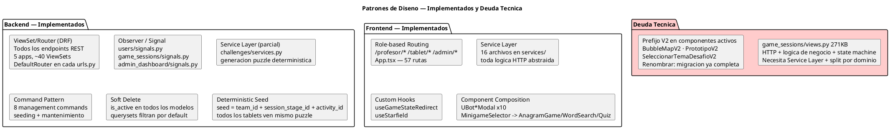
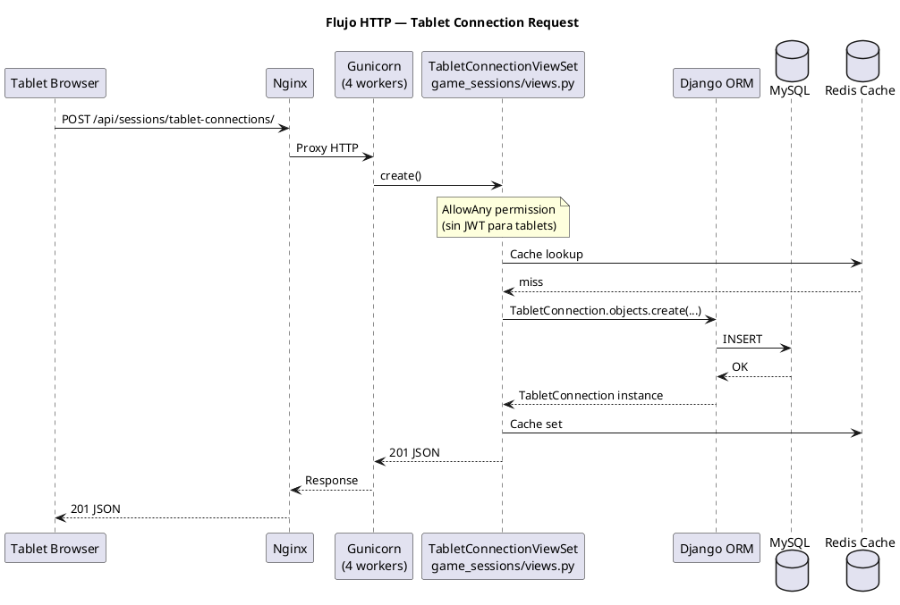
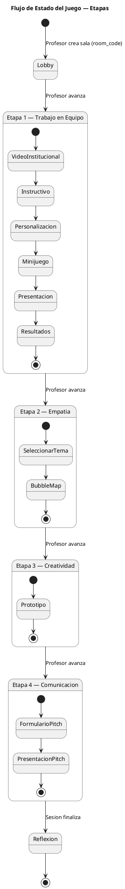
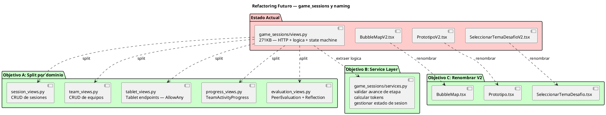

# Arquitectura — Misión Emprende (PlantUML)

> **Render:** VSCode extension [jebbs.plantuml](https://marketplace.visualstudio.com/items?itemName=jebbs.plantuml) + Java + PlantUML jar.  
> Online: paste each block at [plantuml.com/plantuml](https://www.plantuml.com/plantuml/uml/).  
> Los diagramas C4 requieren acceso a internet para descargar la librería C4-PlantUML.

---

## 1. Contexto del Sistema

```plantuml
@startuml
!include https://raw.githubusercontent.com/plantuml-stdlib/C4-PlantUML/master/C4_Context.puml

title Sistema Misión Emprende — Contexto

Person(profesor, "Profesor", "Crea sesiones, controla etapas")
Person(tablet, "Equipo / Tablet", "Juega sin login")
Person(admin, "Administrador UDD", "Gestiona contenido y métricas")

System(mision, "Misión Emprende", "Plataforma educativa de emprendimiento para UDD")

Rel(profesor, mision, "Gestiona sesión")
Rel(tablet, mision, "Participa en juego")
Rel(admin, mision, "Administra contenido")
@enduml
```

---

## 2. Contenedores (Infraestructura Docker)

```plantuml
@startuml
!include https://raw.githubusercontent.com/plantuml-stdlib/C4-PlantUML/master/C4_Container.puml

title Contenedores — Docker Compose

Person(users, "Profesores / Tablets / Admins")

Container(nginx, "Nginx", "Reverse Proxy :80", "Enruta / y /api")
Container(frontend, "React + Vite", "Node :5173", "SPA — 3 roles de usuario")
Container(backend, "Django + Gunicorn", "Python :8000", "API REST — 5 apps Django")
ContainerDb(mysql, "MySQL", ":3306", "Datos persistentes del juego")
ContainerDb(redis, "Redis", ":6379", "Cache de sesiones y tokens")

Rel(users, nginx, "HTTPS")
Rel(nginx, frontend, "GET / -> SPA assets")
Rel(nginx, backend, "GET/POST /api/*")
Rel(backend, mysql, "ORM — mysqlclient")
Rel(backend, redis, "django-redis cache")
@enduml
```

---

## 3. Estructura Backend — Django Apps y Patrones

```plantuml
@startuml
title Estructura Backend — Django Apps y Patrones

package "users" {
  component [models.py\nUser · Professor · Student\nProfessorAccessCode] as u_models
  component [views.py\nserializers.py · urls.py] as u_views
  component [signals.py] as u_signals
  component [custom_jwt.py] as u_jwt
  note right of u_signals
    Observer Pattern
    auto-crea Professor/Admin
    al crear User staff
  end note
}

package "academic" {
  component [models.py\nFaculty · Career · Course] as ac_models
  component [views.py\nserializers.py · urls.py] as ac_views
}

package "challenges" {
  component [models.py\n13 modelos: Stage · Activity\nTopic · Challenge · Minigame\nAnagramWord · ChaosQuestion...] as c_models
  component [views.py\nserializers.py · urls.py] as c_views
  component [services.py] as c_services
  component [management/commands/\ncreate_initial_data\ncreate_minigame_data\ncreate_stage3 · create_stage4\ncreate_video_institucional\nupdate_challenges] as c_cmds
  note right of c_services
    Service Layer
    generacion de sopas
    de letras deterministica
  end note
  note right of c_cmds
    Command Pattern
    6 comandos de seeding
  end note
}

package "game_sessions" {
  component [models.py\n14 modelos: GameSession · Team\nSessionStage · TeamActivityProgress\nTablet · TabletConnection\nTokenTransaction · PeerEvaluation...] as g_models
  component [views.py\n271KB REFACTORIZAR] as g_views
  component [signals.py] as g_signals
  component [management/commands/\ncancel_expired_sessions\ncreate_tablets] as g_cmds
  note right of g_views
    Mezcla HTTP +
    logica de negocio +
    maquina de estados
    del juego
  end note
  note right of g_signals
    Observer Pattern
    cleanup SessionGroup
    al eliminar sesion
  end note
}

package "admin_dashboard" {
  component [models.py\nActivityDurationMetric\nStageDurationMetric\nTopicSelectionMetric\nChallengeSelectionMetric\nDailyMetricsSnapshot] as a_models
  component [views.py\nread-only analytics] as a_views
  component [signals.py] as a_signals
  note right of a_signals
    Observer Pattern
    actualiza metricas al
    completar actividades
    y etapas
  end note
}

package "mision_emprende_backend" {
  component [settings.py\nurls.py · wsgi.py · asgi.py] as cfg
}
@enduml
```



---

## 4. Estructura Frontend — React + TypeScript

```plantuml
@startuml
title Estructura Frontend — React + TypeScript

component [App.tsx\n57 rutas definidas] as app

package "pages/" {
  package "/profesor/*" {
    component [etapa1/\nVideoInstitucional · Instructivo\nPersonalizacion · Presentacion · Resultados] as pe1
    component [etapa2/\nSeleccionarTema · BubbleMap] as pe2
    component [etapa3/\nPrototipo] as pe3
    component [etapa4/\nFormularioPitch · PresentacionPitch] as pe4
    component [Login · Panel · Lobby\nCrearSala · DetalleSesion\nHistorial · Reflexion] as proot
  }

  package "/tablet/*" {
    component [etapa1/\nVideoInstitucional · Instructivo\nPersonalizacion · Minijuego · Presentacion] as te1
    component [etapa2/\nSeleccionarTemaDesafioV2\nBubbleMapV2] as te2
    component [etapa3/\nPrototipoV2] as te3
    component [etapa4/\nFormularioPitch · PresentacionPitch] as te4
    component [Join · Lobby · MapaGalactico\nLoadingScreen · Reflexion] as troot
  }

  package "/admin/*" {
    component [Panel · Dashboard\nManageProfessors\nUpdateGame etapas 1-4] as adm
  }

  package "/evaluacion/:roomCode" {
    component [FormularioEvaluacion] as eval
  }
}

package "components/" {
  package "ui/" {
    component [badge · button · card\ninput · label · progress\nswitch · textarea] as shadcn
  }
  package "minigames/" {
    component [AnagramGame\nWordSearchGame\nGeneralKnowledgeQuiz\nMinigameSelector] as mini
  }
  component [UBot*Modal x10\nmodales guia del asistente] as ubot
  component [Leaderboard · TimerBlock\nGalacticPage · GlassCard\nStarfieldBackground\nConfetti · PodiumScreen] as shared
}

package "services/" {
  component [api.ts\nAxios base + JWT interceptor\nskip-auth para tablets] as api_base
  component [sessions · challenges · teams\ntokenTransactions · teamBubbleMaps\nteamPersonalizations · sessionStages\ntabletConnections · teamActivityProgress\npeerEvaluations · reflectionEvaluations\nacademic · auth · adminDashboard] as svcs
}

package "hooks/ + config/" {
  component [useGameStateRedirect.ts\nredirige segun estado del juego] as h1
  component [useStarfield.ts\nanimacion canvas de estrellas] as h2
  component [phases.ts\nconfiguracion de fases] as phases
}

package "utils/" {
  component [devMode · timerAutoAdvance\ntabletResultsRedirect\ntextEncoding · toast] as utils
}

app --> "pages/"
"pages/" --> "services/"
"pages/" --> "components/"
"services/" --> api_base
@enduml
```



---

## 5. Patrones de Diseño Aplicados



---

## 6. Flujo HTTP — Solicitud de Game Session



---

## 7. Flujo de Estado del Juego



---

## 8. Refactoring Futuro — Objetivos


