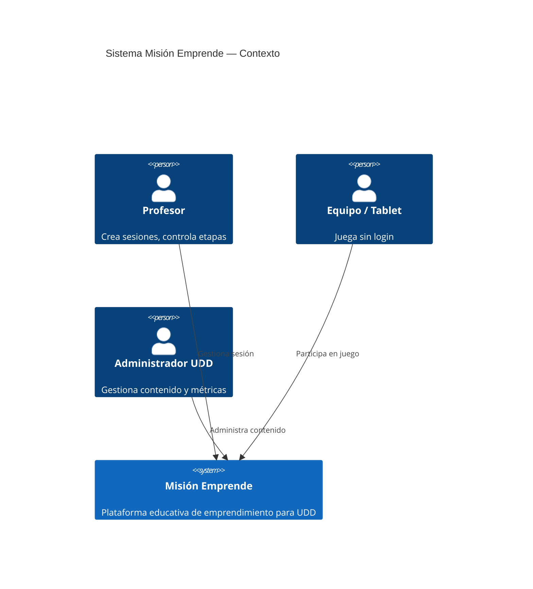
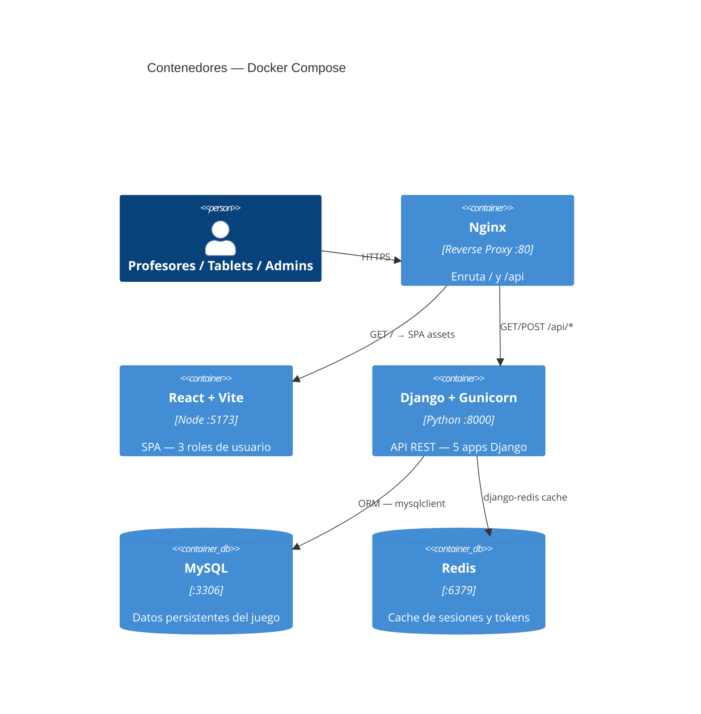
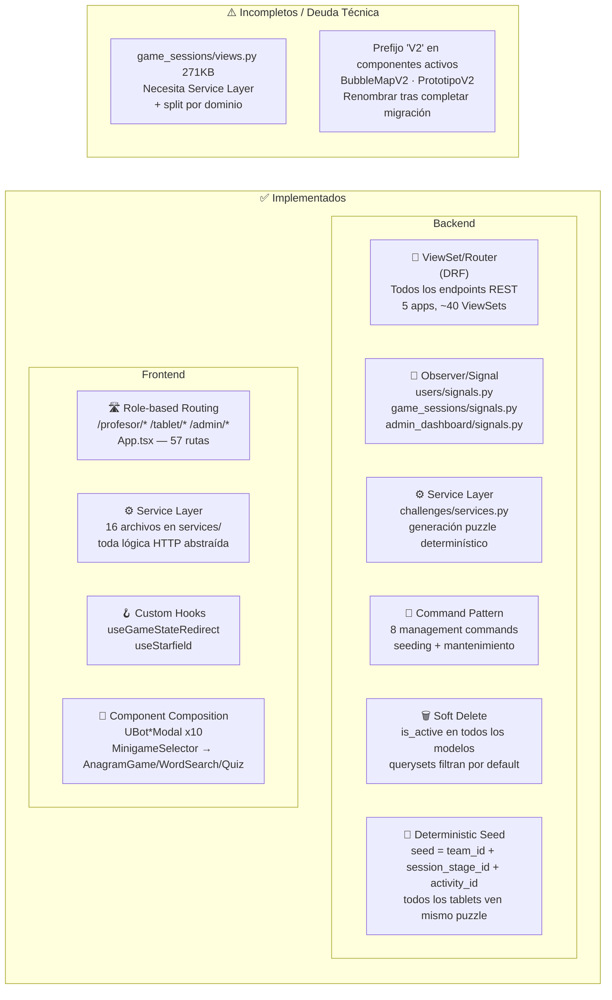
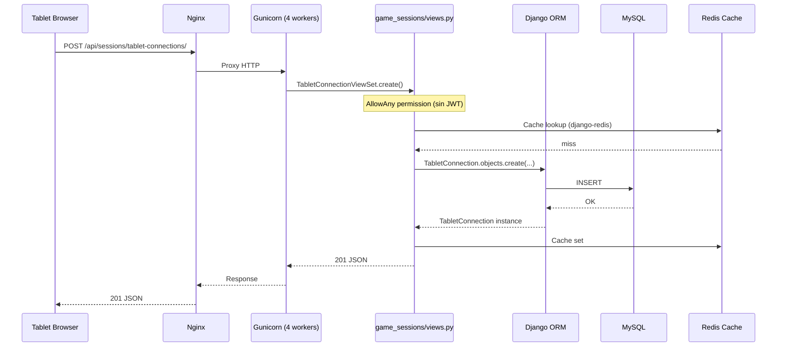
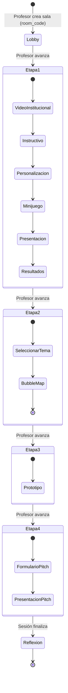
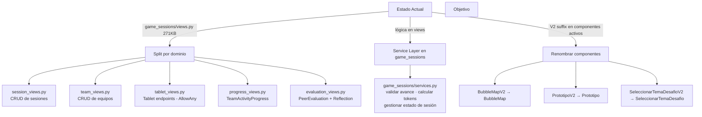

# Arquitectura — Misión Emprende

## 1. Contexto del Sistema

---

## 2. Contenedores (Infraestructura Docker)

---

## 3. Estructura de Directorios — Backend

```mermaid
graph TD
  ROOT["📁 / (raíz)"]

  ROOT --> BE["📁 Backend (Django apps)"]
  ROOT --> FE["📁 frontend/"]
  ROOT --> CONFIG["📄 Configuración"]

  BE --> users["📁 users/"]
  BE --> academic["📁 academic/"]
  BE --> challenges["📁 challenges/"]
  BE --> game_sessions["📁 game_sessions/"]
  BE --> admin_dashboard["📁 admin_dashboard/"]
  BE --> project["📁 mision_emprende_backend/"]

  users --> u1["models.py\nUser · Professor · Student · ProfessorAccessCode"]
  users --> u2["views.py → serializers.py → urls.py"]
  users --> u3["signals.py ← 🔔 Observer Pattern\nauto-crea Professor/Admin al crear User"]
  users --> u4["custom_jwt.py\nJWT personalizado"]

  academic --> ac1["models.py\nFaculty · Career · Course"]
  academic --> ac2["views.py → serializers.py → urls.py"]

  challenges --> c1["models.py\n13 modelos: Stage · Activity · Topic\nChallenge · Minigame · AnagramWord..."]
  challenges --> c2["views.py → serializers.py → urls.py"]
  challenges --> c3["services.py ← ✅ Service Layer\ngeneración de sopas de letras"]
  challenges --> c4["management/commands/\n6 comandos de seeding ← 🔨 Command Pattern"]

  game_sessions --> g1["models.py\n14 modelos: GameSession · Team\nSessionStage · TeamActivityProgress..."]
  game_sessions --> g2["views.py ⚠️ 271KB\n¡Mezcla HTTP + lógica de negocio!\nRefactorizar en task futura"]
  game_sessions --> g3["signals.py ← 🔔 Observer Pattern\ncleanup al eliminar SessionGroup"]
  game_sessions --> g4["management/commands/\ncancel_expired_sessions · create_tablets"]

  admin_dashboard --> a1["models.py\n5 modelos de métricas"]
  admin_dashboard --> a2["views.py — solo lectura (analytics)"]
  admin_dashboard --> a3["signals.py ← 🔔 Observer Pattern\nactualiza métricas al completar actividades"]

  project --> p1["settings.py · urls.py\nwsgi.py · asgi.py"]
```

---

## 4. Estructura de Directorios — Frontend

```mermaid
graph TD
  SRC["📁 src/"]

  SRC --> APP["App.tsx\n57 rutas definidas"]
  SRC --> PAGES["📁 pages/"]
  SRC --> COMP["📁 components/"]
  SRC --> SVC["📁 services/"]
  SRC --> HOOKS["📁 hooks/ + config/"]
  SRC --> UTILS["📁 utils/"]

  PAGES --> PROF["📁 profesor/\n/profesor/*"]
  PAGES --> TAB["📁 tablets/\n/tablet/*"]
  PAGES --> ADM["📁 admin/\n/admin/*"]
  PAGES --> EVAL["📁 evaluacion/\n/evaluacion/:roomCode"]

  PROF --> PE1["etapa1/ VideoInstitucional · Instructivo\nPersonalizacion · Presentacion · Resultados"]
  PROF --> PE2["etapa2/ SeleccionarTema · BubbleMap"]
  PROF --> PE3["etapa3/ Prototipo"]
  PROF --> PE4["etapa4/ FormularioPitch · PresentacionPitch"]

  TAB --> TE1["etapa1/ VideoInstitucional · Instructivo\nPersonalizacion · Minijuego · Presentacion"]
  TAB --> TE2["etapa2/ SeleccionarTemaDesafioV2\nBubbleMapV2"]
  TAB --> TE3["etapa3/ PrototipoV2"]
  TAB --> TE4["etapa4/ FormularioPitch · PresentacionPitch"]

  COMP --> UI["📁 ui/ — shadcn/ui\nbadge · button · card · input..."]
  COMP --> MINI["📁 minigames/\nAnagramGame · WordSearchGame\nGeneralKnowledgeQuiz · MinigameSelector"]
  COMP --> ADMCOMP["📁 admin/\nDashboard · ManageProfessors · UpdateGame*"]
  COMP --> SHARED["Componentes compartidos\nLeaderboard · TimerBlock · GalacticPage\nConfetti · StarfieldBackground\nUBot*Modal x10"]

  SVC --> APIBASE["api.ts — Axios base\nJWT interceptor · tablet skip-auth"]
  SVC --> SVCS["16 archivos de servicio\nsessions · challenges · teams\ntokenTransactions · peerEvaluations\nreflectionEvaluations · academic..."]

  HOOKS --> H1["useGameStateRedirect.ts\nredirige según estado del juego"]
  HOOKS --> H2["useStarfield.ts\nanimación canvas de estrellas"]

  UTILS --> UT["devMode · timerAutoAdvance\ntabletResultsRedirect · textEncoding · toast"]
```

---

## 5. Patrones de Diseño Aplicados

---

## 6. Flujo de una Solicitud HTTP (Game Session)

---

## 7. Flujo de Estado del Juego (Etapas)

---

## 8. Qué Patrones Aplicar en Refactoring Futuro

